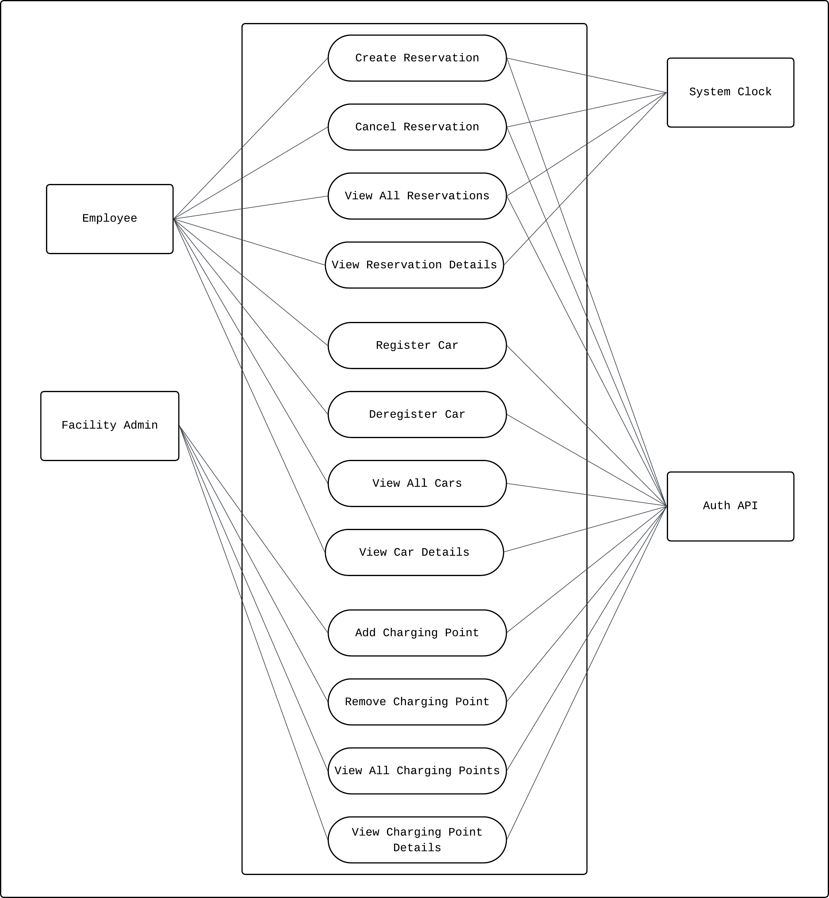

# System Behavior (Use Cases)

## Use Case Diagram

Primary Actors:

- Employees
- Facility Admin

Use Cases:

- Create Reservation
- Cancel Reservation
- View All Reservations
- View Reservation Details
- Register Car
- Deregister Car
- View All Cars
- View Car Details
- Add Charging Point
- Remove Charging Point
- View Charging Point Details

Secondary Actors:

- System Clock
- Auth API

## Use Case Narrative: Create Reservation

### Use Case Name

Create Reservation

### Primary Actor

Employee

### Goal

The Employee successfully reserves a Charging Point for a timeframe.

### Preconditions

- The Employee is authenticated through the Auth API.
- The Employee has at least one Car registered.
- The Charging Points are registered and available.

### Main Success Scenario

1. The Employee selects the date, estimated time of arrival and Car.
2. The system tells which Charging Points are available.
3. The Employee selects the Charging Point by its ID.
4. The system calculates maximum reservation time according to selected Car details.
5. The system identifies possible time collisions.
6. The system creates the reservation.
7. The system provides a reservation creation confirmation to the Employee.

### Extensions (Alternative Flows)

- 1a. No Car is registered:
  - The system notifies the user to register a Car.
- 2a. No available Charging Points:
  - The system notifies the Employee and suggests a new time slot.
- 5a. Collision found:
  - The system notifies the Employee and suggests sticking or switching to another time slot or Charging Point.

### Postconditions

- The reservation is created and stored in the system.
- The Employee receives a reservation confirmation.

## Use Case Narrative: Cancel Reservation

### Use Case Name

Cancel Reservation

### Primary Actor

Employee

### Goal

The Employee successfully cancels a reservation.

### Preconditions

- The Employee is authenticated through the Auth API.
- The Employee has a future reservation.

### Main Success Scenario

1. The Employee selects the given reservation from the history.
2. The system displays the reservation details.
3. The Employee cancels the reservation.
4. The system prompts the user for confirmation.
5. The system provides a reservation cancellation confirmation to the Employee.

### Extensions (Alternative Flows)

- 1a. Reservation has already expired.
  - The system does not allow the user to cancel the reservation.

### Postconditions

- The reservation is canceled and removed from the system.
- The Employee receives a cancellation confirmation.

## Use Case Narrative: View All Reservations

### Use Case Name

View All Reservations

### Primary Actor

Employee

### Secondary Actors

- Auth API
- System Clock

### Goal

The Employee successfully views a list of all their reservations.

### Preconditions

- The Employee is authenticated through the Auth API.

### Main Success Scenario

1. The Employee requests to view their reservations.
2. The system uses System Clock to categorize reservations as past or future.
3. The system displays a chronologically ordered list of all reservations with basic information.

### Extensions (Alternative Flows)

- 2a. No reservations found:
  - The system notifies the user that no reservations exist.

### Postconditions

- A list of all reservations is displayed to the Employee with proper time context.

## Use Case Narrative: View Reservation Details

### Use Case Name

View Reservation Details

### Primary Actor

Employee

### Secondary Actors

- Auth API
- System Clock

### Goal

The Employee successfully views detailed information about a specific reservation.

### Preconditions

- The Employee is authenticated through the Auth API.
- The Employee has selected a specific reservation.

### Main Success Scenario

1. The system retrieves the selected reservation details.
2. The system uses System Clock to calculate relative time information.
3. The system displays detailed information about the selected reservation.

### Extensions (Alternative Flows)

- 1a. Reservation not found:
  - The system notifies the user that the reservation does not exist.

### Postconditions

- The detailed reservation information is displayed to the Employee.

## Use Case Narrative: Register Car

### Use Case Name

Register Car

### Primary Actor

Employee

### Goal

The Employee successfully registers a Car.

### Preconditions

- The Employee is authenticated through the Auth API.

### Main Success Scenario

1. The Employee registers a Car with mandatory details.
2. The system displays the details and prompts the user for confirmation.
3. The system registers the Car.
4. The system provides a Car registration confirmation to the Employee.

### Extensions (Alternative Flows)

- 1a. Missing mandatory details.
  - The system does not allow the user to register the Car.

### Postconditions

- The Car is registered and stored in the system.
- The Employee receives a Car registration confirmation.

## Use Case Narrative: Deregister Car

### Use Case Name

Deregister Car

### Primary Actor

Employee

### Goal

The Employee successfully deregisters a Car.

### Preconditions

- The Employee is authenticated through the Auth API.
- The Employee has at least one registered Car.

### Main Success Scenario

1. The Employee selects a registered Car.
2. The system displays the details.
3. The Employee deregisters the Car.
4. The system prompts the user for confirmation.
5. The system deregisters the Car.
6. The system provides a Car deregistration confirmation to the Employee.

### Extensions (Alternative Flows)

- 1a. No registered Cars available:
  - The system notifies the user that no Cars are registered.

### Postconditions

- The Car is deregistered and removed from the system.
- The Employee receives a Car deregistration confirmation.

## Use Case Narrative: View All Cars

### Use Case Name

View All Cars

### Primary Actor

Employee

### Secondary Actors

- Auth API

### Goal

The Employee successfully views a list of all their registered Cars.

### Preconditions

- The Employee is authenticated through the Auth API.

### Main Success Scenario

1. The Employee requests to view their registered Cars.
2. The system displays a list of all registered Cars with basic information.

### Extensions (Alternative Flows)

- 2a. No Cars registered:
  - The system notifies the user that no Cars are registered.

### Postconditions

- A list of all Cars is displayed to the Employee.

## Use Case Narrative: View Car Details

### Use Case Name

View Car Details

### Primary Actor

Employee

### Secondary Actors

- Auth API

### Goal

The Employee successfully views detailed information about a specific Car.

### Preconditions

- The Employee is authenticated through the Auth API.
- The Employee has selected a specific Car.

### Main Success Scenario

1. The system retrieves the selected Car details.
2. The system displays detailed information about the selected Car.

### Extensions (Alternative Flows)

- 1a. Car not found:
  - The system notifies the user that the Car does not exist.

### Postconditions

- The detailed Car information is displayed to the Employee.

## Use Case Narrative: Add Charging Point

### Use Case Name

Add Charging Point

### Primary Actor

Facility Admin

### Goal

The Facility Admin successfully adds a Charging Point

### Preconditions

- The Facility Admin is authenticated through the Auth API.

### Main Success Scenario

1. The Facility Admin enters the Charging Point details.
2. The system validates the details and checks for duplicate IDs.
3. The system displays the details and prompts the user for confirmation.
4. The system registers the Charging Point.
5. The system provides a Charging Point registration confirmation to the Facility Admin.

### Extensions (Alternative Flows)

- 1a. Missing mandatory details:
  - The system does not allow the user to add a Charging Point.
- 2a. Duplicate Charging Point ID:
  - The system notifies the user that the ID already exists and requests a different ID.

### Postconditions

- The Charging Point is registered and stored in the system.
- The Facility Admin receives a Charging Point registration confirmation.

## Use Case Narrative: Remove Charging Point

### Use Case Name

Remove Charging Point

### Primary Actor

Facility Admin

### Goal

The Facility Admin successfully removes a Charging Point from the system.

### Preconditions

- The Facility Admin is authenticated through the Auth API.
- At least one Charging Point exists in the system.

### Main Success Scenario

1. The Facility Admin requests to view all Charging Points.
2. The system displays a list of all registered Charging Points.
3. The Facility Admin selects a Charging Point to remove.
4. The system checks if the Charging Point has any active reservations.
5. The system displays the Charging Point details and prompts for confirmation.
6. The Facility Admin confirms the removal.
7. The system removes the Charging Point.
8. The system provides a Charging Point removal confirmation to the Facility Admin.

### Extensions (Alternative Flows)

- 2a. No Charging Points available:
  - The system notifies the user that no Charging Points are registered.
- 4a. Active reservations exist:
  - The system notifies the user that the Charging Point cannot be removed due to active reservations and suggests canceling them first.

### Postconditions

- The Charging Point is removed from the system.
- The Facility Admin receives a Charging Point removal confirmation.

## Use Case Narrative: View Charging Point Details

### Use Case Name

View Charging Point Details

### Primary Actor

Facility Admin

### Goal

The Facility Admin successfully views details of Charging Points in the system.

### Preconditions

- The Facility Admin is authenticated through the Auth API.
- At least one Charging Point exists in the system.

### Main Success Scenario

1. The Facility Admin requests to view all Charging Points.
2. The system displays a list of all registered Charging Points.
3. The Facility Admin selects a specific Charging Point.
4. The system displays detailed information about the selected Charging Point.

### Extensions (Alternative Flows)

- 2a. No Charging Points available:
  - The system notifies the user that no Charging Points are registered.

### Postconditions

- The Charging Point details are displayed to the Facility Admin.
