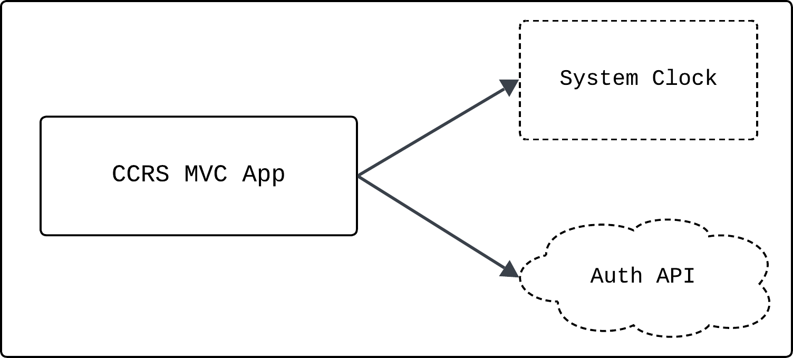

# System Structure (Architecture)

## Architecture Style

- Frontend
- Monolithic Backend

## Architecture Diagram

## Tech Stack

Programming Languages:
- Python

Database:
- Postgres

## Repository Strategy

Frontend and Monolithic Backend Repository Structure
